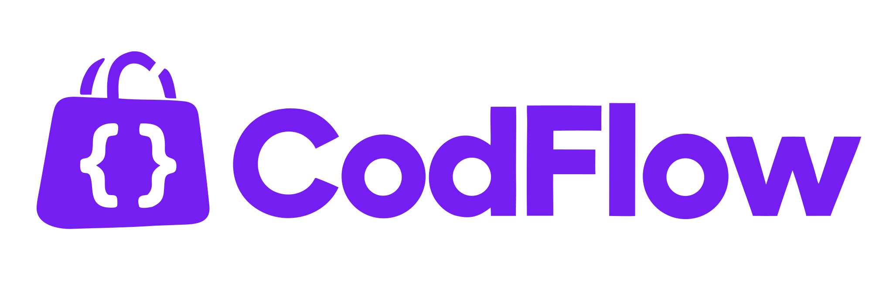

# CodFlow



**The open-source, COD-first e-commerce platform for Algeria — built agentic-ready.**

Cash on Delivery meets serverless infrastructure. Self-host your entire commerce stack on Cloudflare with zero transaction fees, connect to Algeria's delivery carriers, and optimize Meta ads for real deliveries instead of door refusals.

---

## Get Started

Choose your path:

<table>
<tr>
<td width="50%" valign="top">

### 🚀 **I want to run CodFlow**

See it in action and deploy your own store.

**[→ See It in Action](#-see-it-in-action)**  
**[→ What works today](#-whats-included)**  
**[→ Quick setup guide](#-quick-setup)**  
**[→ Production deployment](./docs/DEPLOYMENT.md)**

</td>
<td width="50%" valign="top">

### 💻 **I want to contribute**

Build features or customize CodFlow.

**[→ Contributing guide](./CONTRIBUTING.md)**  
**[→ Architecture overview](./docs/ARCHITECTURE.md)**  
**[→ AI agent instructions](./AGENTS.md)**

</td>
</tr>
</table>

---

## 🎥 See It in Action

Watch the step-by-step setup guide:

[](https://youtu.be/rJPCGQnDZ18)

**[▶️ Watch: CodFlow Setup & Deployment Guide](https://youtu.be/rJPCGQnDZ18)**

---

## 🎯 The Problem CodFlow Solves

E-commerce in Algeria is **95%+ Cash on Delivery (الدفع عند الاستلام)**. Western platforms like Shopify and local tools charge per-transaction fees, require expensive VPS hosting, and lock your data in their databases.

**CodFlow is the first and only open-source COD e-commerce platform built for Algeria.**

| The Reality | Western/Local Platforms | CodFlow |
| :--- | :--- | :--- |
| **Transaction fees eat margins** | 2–5% per order + monthly SaaS fees | **$0 transaction fees** — pay only Cloudflare hosting ($0–$5/mo) |
| **Your data locked in their system** | Can't export, can't migrate, vendor lock-in | **You own everything** — D1 database, R2 images, full control |
| **Expensive hosting** | VPS servers, maintenance, scaling costs | **Serverless Cloudflare** — auto-scales, zero maintenance |
| **4+ carrier portals** | Juggle Yalidine, ZR, NOEST, EcoTrack separately | **Unified carrier API** — one integration for all carriers |
| **In-house drivers ignored** | No native driver dispatch or per-wilaya pay | **Built-in driver management** with compensation and cash settlement |
| **Ads optimize for form fills, not deliveries** | Meta Pixel fires on checkout submit (30–50% refuse at door) | **Meta CAPI fires at actual delivery** — optimize ads for real buyers |

**Deploy CodFlow to your own Cloudflare account in minutes. No monthly fees. No transaction cuts. 100% open-source (Apache 2.0).**

---

## ✅ What's Included

CodFlow v1.1.0 — here's what works today:

### Storefront (`cod-astro/theme01`)
- ✅ **Landing pages (`/lp/[slug]`)** — one-product marketing pages: stacked image story + COD form, no nav chrome
- ✅ Single-page COD checkout with live shipping calculation
- ✅ Home delivery **or** carrier stop-desk pickup selection
- ✅ Quantity-tier offers ("Buy 2 get 10% off", "Buy 3 free shipping")
- ✅ Order-verified product reviews (star ratings + Arabic/French text)
- ✅ Trilingual: Arabic (RTL), French, English
- ✅ Abandoned cart telemetry for recovery campaigns
- ✅ Optional WhatsApp phone verification at checkout ([DZVerify](https://dzverify.com), off by default)
- ✅ Optional Cloudflare Turnstile bot protection on the checkout form ([Turnstile](https://www.cloudflare.com/products/turnstile/), off by default)

### Merchant Dashboard (`cod-client-astro`)
- ✅ Order management with full COD lifecycle tracking
- ✅ Product catalog with multi-attribute variants (size, color, SKU) and image uploads
- ✅ Inventory tracking with low-stock alerts and adjustment history
- ✅ Promotion engine (Buy X Get Y, free shipping rules)
- ✅ **Landing page studio** — two-sidebar builder (image stack + spacing), product-picker-first creation, publish flow, live link copy
- ✅ **Landing page comparison** — per-product A/B table (views, orders, CVR, revenue) to pick winning creatives
- ✅ Review moderation (approve, reject, delete)
- ✅ Customer CRM with profiles, order history, groups, and tags
- ✅ Delivery: in-house drivers, per-wilaya compensation, cash settlement
- ✅ Carrier company management (credentials, stop-desk sync, reconciliation)
- ✅ Team RBAC with granular permission scopes and API keys
- ✅ Meta Pixel & CAPI configuration UI
- ✅ Abandoned order recovery
- ✅ MCP agent connection management
- ✅ Trilingual: Arabic (RTL), French, English

### Delivery Engine
- ✅ 4 Algerian carriers + EcoTrack (80+ couriers behind one API)
- ✅ One-click shipment creation with printable labels
- ✅ Real-time webhook tracking (Yalidine, ZR Express with HMAC verification)
- ✅ Carrier delivery-zone name sync — dispatches carry the carrier's exact wilaya/commune spellings (Yalidine)
- ✅ Dispatch-time delivery-type switching (home ⇄ stop desk) with wilaya-scoped desk picking
- ✅ Webhook event log with per-event outcomes (applied / ignored / unmapped / error) per carrier
- ✅ Stop-desk catalog syncing across 58 wilayas
- ✅ In-house driver fleet management
- ✅ Per-wilaya driver compensation with cash settlement
- ✅ Partial returns with automatic inventory restock

### Growth Engine
- ✅ Meta Pixel (browser) + Conversions API (server) dual setup with event deduplication
- ✅ Merchant-chosen conversion event: `Lead` at order placement or `Purchase` at confirmed delivery
- ✅ Test Mode toggle routes CAPI events to Meta's test stream (`test_event_code`)
- ✅ Graph API v26.0 with 7-day attribution window compliance
- ✅ PII hashed per Meta spec (phone, names, city, zip, country, external_id); IP, User-Agent, `fbp`, `fbc` sent unhashed as required
- ✅ `fbp` and `fbc` attribution preservation
- ✅ Durable retry with Cloudflare Workflows (network + Meta 5xx, exponential backoff)
- ✅ CAPI event audit log (`capi_event_log`) for every send attempt

### AI & Agentic (MCP)
- ✅ RFC 9728 OAuth Protected Resource Discovery with dynamic client registration
- ✅ OAuth login relay from the dashboard (login-ticket bridge)
- ✅ 15 RBAC-gated tool sets (orders, products, stock, offers, landing pages, reviews, customers, drivers, etc.)
- ✅ Stateless elicitation with HMAC-sealed confirmation state
- ✅ Compatible with Claude, Cursor, ChatGPT, LibreChat

### Backend (`cod-server`)
- ✅ Hono 4 on Cloudflare Workers (sub-5ms cold starts)
- ✅ Drizzle ORM + D1 (SQLite)
- ✅ D1 scale layer: indexed hot paths, atomic batched order writes, keyset pagination
- ✅ Auto-generated OpenAPI 3.1 spec at `/api/docs`
- ✅ Standardized error envelopes with semantic codes
- ✅ R2 image storage with edge caching
- ✅ KV-backed rate limiting

**Known Limitations:**  
See [`docs/KNOWN_LIMITATIONS.md`](./docs/KNOWN_LIMITATIONS.md) for honest coverage of incomplete features and platform constraints.

---

## ⚡ Quick Setup

Run CodFlow locally in 5 steps:

> 🤖 **Using an AI Coding Assistant?** CodFlow includes an autonomous setup skill. Tell your agent: *"Set up CodFlow"* and it will follow the [`codflow-setup` runbook](./.agents/skills/codflow-setup/SKILL.md).

### Prerequisites
- **Node.js 22.12+** and npm
- **Wrangler CLI**: `npm install -g wrangler`
- Free **Cloudflare account**

### 1. Clone & Install
```bash
git clone https://github.com/bighadj22/codflow.git
cd codflow
npm ci
```

### 2. Create Cloudflare Resources
Names are yours to choose — scripts read them from the root `.env`
(see step 3), so nothing is hardcoded.

```bash
wrangler login
wrangler d1 create my-codflow-db
wrangler r2 bucket create my-codflow-images
wrangler kv namespace create RATE_LIMIT
wrangler kv namespace create OAUTH_KV
```

### 3. Configure Environment
```bash
# Repo root — resource names for the seeders, the D1 wrapper, the R2 CORS
# setup and the storefront deploy helper. Precedence: process.env > .env > default.
cp .env.example .env
# Set COD_ACCOUNT_ID, COD_DB_NAME, COD_R2_BUCKET_NAME, COD_SERVER_URL, COD_MEDIA_DOMAIN

# Backend
cd cod-server
cp .dev.vars.example .dev.vars
cp wrangler.toml.example wrangler.toml
# Update wrangler.toml with your D1 database_id, R2 bucket_name, KV ids

# Dashboard
cd ../cod-client-astro
cp wrangler.toml.example wrangler.toml   # same D1 database_id as cod-server + your KV id
cp .env.example .env
cp .dev.vars.example .dev.vars
# Set BETTER_AUTH_SECRET (same value as cod-server's, e.g. openssl rand -hex 32)

# Storefront
cd ../cod-astro/theme01
cp .dev.vars.example .dev.vars
```

### 4. Setup Database & Admin
```bash
cd cod-server
npm run db:setup:local

cd ../cod-client-astro
ADMIN_EMAIL=admin@example.com ADMIN_NAME=Admin npm run seed:admin
# ⚠️ Save the generated password and API key
```

### 5. Start Dev Servers
Open three terminals:

```bash
# Terminal 1: Backend (http://localhost:8787)
cd cod-server && npm run dev

# Terminal 2: Dashboard (http://localhost:4321)
cd cod-client-astro && npm run dev

# Terminal 3: Storefront (http://localhost:4321 → use a different port, see theme README)
cd cod-astro/theme01 && npm run dev
```

> ⚠️ The dashboard and storefront both default to port 4321 — run them on
> different ports (`astro dev --port 4322` for one of them) or run only one
> at a time.

### 6. Enable Image Uploads

Product image uploads require R2 API tokens and CORS configuration. See the [R2 setup guide](./cod-server/src/endpoints/images/README.md) for:
- Creating R2 API tokens
- Setting CORS policy on the bucket
- Adding a custom domain for serving images

**Need more detail?** See [`docs/DEPLOYMENT.md`](./docs/DEPLOYMENT.md) for production deployment.

---

## 🚢 Production Deployment

Deploy all three apps to Cloudflare Workers:

```bash
# 1. Backend
cd cod-server
npm run deploy -- --env production
wrangler secret put BETTER_AUTH_SECRET
wrangler secret put STORE_API_KEY

# 2. Dashboard
cd ../cod-client-astro
npm run build && npm run deploy
wrangler secret put BETTER_AUTH_SECRET         # same value as cod-server's
wrangler secret put MCP_LOGIN_TICKET_SECRET    # same value as cod-server's

# 3. Storefront
cd ../cod-astro/theme01
# Set COD_SERVER_URL in wrangler.jsonc to your deployed backend URL
npm run build && npm run deploy
wrangler secret put STORE_API_KEY
```

**Important:** Cloudflare blocks Worker-to-Worker fetch between `*.workers.dev` hosts. For production, put at least `cod-server` on a custom domain and point `COD_SERVER_URL` at it.

**R2 Image Uploads:** For production image uploads, see [R2 setup guide](./cod-server/src/endpoints/images/README.md) for API tokens, CORS policy, and custom domain configuration.

**Full deployment guide:** [`docs/DEPLOYMENT.md`](./docs/DEPLOYMENT.md)

---

## 🏗️ Architecture

```
                          ┌──────────────────────────────────────────┐
                          │              cod-shared                  │
                          │   D1 schema • RBAC scopes • queries      │
                          └───────────────┬──────────────────────────┘
                                          │ relative imports
               ┌──────────────────────────┼──────────────────────────┐
               │                          │                          │
       ┌───────▼───────┐         ┌────────▼────────┐        ┌────────▼────────┐
       │  Storefront   │         │     Backend     │        │   Dashboard     │
       │  cod-astro    │──/store─▶  cod-server     │◀──/api─│ cod-client-astro│
       │  (Astro 7)    │  API    │ (Hono + Workflows) API   │  (Astro 7)      │
       └───────┬───────┘         └───┬─────┬───────┘        └─────────────────┘
               │                     │     │
               │               /webhooks   │ CodCapiWorkflow
               │              carrier calls│
               │                     │     └─────────▶ Meta Conversions API
               │                     │                 (Purchase @ delivered)
               │                     │
               │              ┌──────▼─────┐
               │              │ Carriers    │   Yalidine • ZR Express  (webhooks)
               │              │  APIs       │   NOEST • EcoTrack       (tracking pull)
               │              └─────────────┘
               │
               │        /images (R2)      /mcp (AI agents, OAuth-scoped)
               └──────────────────────────────────────────────────────▶
```

**Tech Stack:**
- **Storefront:** Astro 7, Tailwind CSS v4 → Cloudflare Workers + Static Assets
- **Backend:** Hono 4, Drizzle ORM, Better Auth, Workflows → Cloudflare Workers + D1 + R2 + KV
- **Dashboard:** Astro 7 (prerendered static + auth worker) → Cloudflare Workers + D1 + KV
- **Shared:** Drizzle schema, RBAC scopes, error codes

**More detail:** [`docs/ARCHITECTURE.md`](./docs/ARCHITECTURE.md)

---

## 🧪 Testing

```bash
# Backend tests (handlers, workflows, OpenAPI, MCP)
cd cod-server && npm test

# Dashboard tests (feature models, i18n guards, API seam)
cd cod-client-astro && npm test

# Storefront tests (property-based, cart calculations)
cd cod-astro/theme01 && npm test

# TypeScript verification
cd cod-server && npm run typecheck
cd cod-client-astro && npm run typecheck
```

CI runs typecheck + tests for cod-server and cod-client-astro, plus
astro check + tests for theme01.

---

## 📚 Documentation

| Document | Purpose |
| :--- | :--- |
| **[docs/DEPLOYMENT.md](./docs/DEPLOYMENT.md)** | Cloudflare production deployment |
| **[docs/ARCHITECTURE.md](./docs/ARCHITECTURE.md)** | System map and data flows |
| **[docs/CONFIGURATION.md](./docs/CONFIGURATION.md)** | All environment variables and configs |
| **[docs/KNOWN_LIMITATIONS.md](./docs/KNOWN_LIMITATIONS.md)** | Incomplete features and platform constraints |
| **[docs/WHATSAPP-OTP-VERIFICATION.md](./docs/WHATSAPP-OTP-VERIFICATION.md)** | WhatsApp OTP verification feature |
| **[docs/TURNSTILE.md](./docs/TURNSTILE.md)** | Cloudflare Turnstile checkout bot protection |
| **[docs/EMAIL-SENDING.md](./docs/EMAIL-SENDING.md)** | Transactional email feature (Sendili) |
| **[CONTRIBUTING.md](./CONTRIBUTING.md)** | Development standards and PR workflow |
| **[AGENTS.md](./AGENTS.md)** | Repository instructions for AI coding assistants |
### 🎬 Video Tutorial

**[▶️ Watch: How to edit your CodFlow theme](https://youtu.be/zZGWdEeUXVo)**

---

## 🗺️ Roadmap

### Planned

- 📈 **Deeper dashboard analytics** — revenue, delivery-rate, and return-rate trends
- 📦 **More Themes** — Additional storefront themes beyond `theme01`
- 📘 **Theme Editing Guides** — Comprehensive guides for customizing and creating themes
- ☁️ **CodFlow Cloud** — One-click deployment from dashboard for agencies to resell CodFlow
- 📧 **Email order notifications & admin alerts** — extend the Sendili integration beyond transactional mail

### Recently Shipped

- ✅ **Yalidine Hardening** — full 36-status webhook mapping (live-verified return flows), HMAC-SHA256 signature verification, per-carrier delivery-zone name sync, dispatch-time delivery-type switching, and a webhook events log for every webhook-capable carrier
- ✅ **Landing Pages** — one-product marketing pages (image stack + COD order form) with the Studio builder, per-link stats, A/B comparison, order attribution, and 7 MCP tools
- ✅ **Astro Dashboard** — the merchant dashboard now runs on Astro (was Next.js)
- ✅ **WhatsApp OTP Verification** — [DZVerify.com](https://dzverify.com) phone verification at checkout
- ✅ **Cloudflare Turnstile** — optional per-store bot protection on the checkout form (off by default)
- ✅ **EcoTrack Integration** — 80+ Algerian couriers behind one API
- ✅ **Transactional Email (Sendili)** — [Sendili.com](https://sendili.com) powers team-invite emails and password-reset emails; merchants configure their API key and verified sending domain in Settings → Email Sending

---

## 🤝 Contributing

We welcome contributions from developers across Algeria and the global open-source community.

1. Fork the repo and create a feature branch (`feat/amazing-feature`)
2. Maintain code-verified claims and test coverage
3. Keep credentials and live API keys out of commits
4. Submit a PR referencing the related issue

See **[CONTRIBUTING.md](./CONTRIBUTING.md)** for detailed guidelines.

---

## 📄 License

**Apache License 2.0** — 100% free and open-source.  
See [`LICENSE`](./LICENSE) and [`NOTICE`](./NOTICE) for details.

---

## 🔗 Resources

- **Repository:** [github.com/bighadj22/codflow](https://github.com/bighadj22/codflow)
- **Video Setup Guide:** [Watch on YouTube](https://youtu.be/rJPCGQnDZ18)
- **Changelog:** [CHANGELOG.md](./CHANGELOG.md)
- **Security Policy:** [SECURITY.md](./SECURITY.md)

---

**Version:** v1.1.0 — Self-hostable on Cloudflare.  
Built with ❤️ for Algerian e-commerce.
